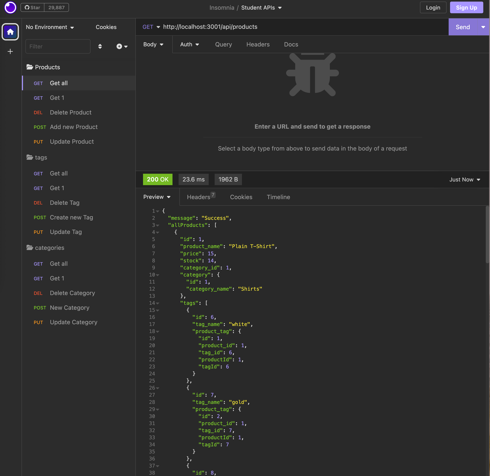

# E-Commerce Back End 

A backend Node/Express server, RESTful API, and database for e-commerce

[](https://opensource.org/licenses/MIT)



## Description 

This project is an example of a E-Commerce RESTful API Server for searching for products, changing data, deleting products, tags or categories, and performing updates. All CRUD operations. 

This API simulates a simple E-com application and applies full server and database capabilities for a e-com brand.

This is a server based project and has no front end at this time. Utilize an application like Insomnia to query the API. 

## Table of Contents

- [Installation](#installation)
- [Usage](#usage)
- [Contributions](#contributions)
- [Questions](#questions)
- [License](#license)

## Installation

```bash
npm install
```

  For installing this CLI application, you will need to install the dependencies .

  You will need mysql setup on your dev device you are working on.

  mysql connections are hidden in a .env file with the following layout. Create and place your login information in this file:

  ```
  DB = <db created in schema.sql>
  PASSWORD = <password>
  ```

  you will also need to source your db with the seed data using 

  ```bash
  node seeds/index.js
  ```

## Usage

once packages are installed, open a terminal and type the following: 

  ```bash
  node server.js
```

This will start your sever at which you can make API calls through Insomnia or the like. 

example API call for all products would be:

```
http://localhost:3001/api/products
```

You can query the data base and perform all CRUD operations on Products, Tags, and Categories for a e-com backend.

## Demo

[Demo Video Here](https://drive.google.com/file/d/11QY6IKioNOYfRVmN2SksbCyj1XSQIias/view?usp=sharing)


## Contributions
  You are welcome to contribute!

## Questions
  Please reach out to me if you have any questions about the functionality of the app or installation
  [GitHub](https://github.com/1willcobb) |
  [Email](mailto:cobb.will@gmail.com)

## License
[MIT License](https://choosealicense.com/licenses/mit/)

  The license used for this application is MIT License which can be found at the [here](https://choosealicense.com/licenses/mit/)
